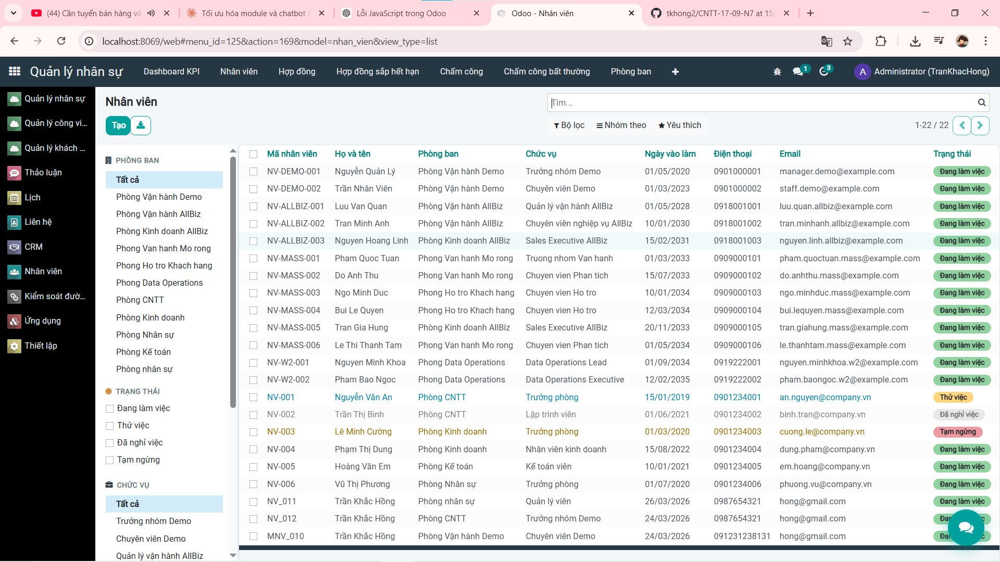
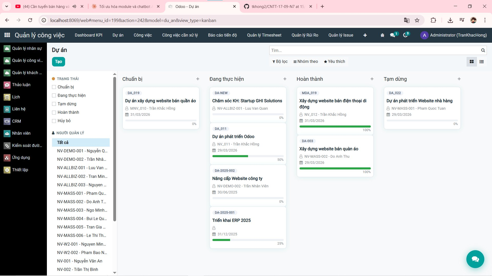
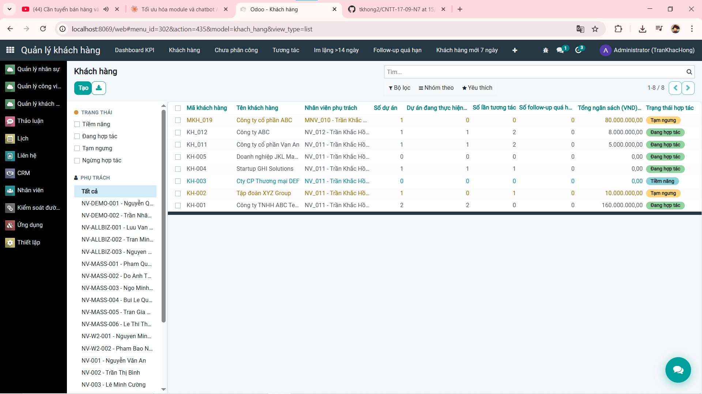

<h2 align="center">
    <a href="https://dainam.edu.vn/vi/khoa-cong-nghe-thong-tin">
    🎓 Faculty of Information Technology (DaiNam University)
    </a>
</h2>
<h2 align="center">
    PLATFORM ERP: HỆ THỐNG QUẢN LÝ KHÁCH HÀNG + CÔNG VIỆC
</h2>
<h3 align="center">
    Trần Khắc Hồng, Hà Tuấn Huy, Vũ Hồng Sơn
</h3>


<div align="center">
    <p align="center">
        
        
        
    </p>

[](https://www.facebook.com/DNUAIoTLab)
[](https://dainam.edu.vn/vi/khoa-cong-nghe-thong-tin)
[](https://dainam.edu.vn)

</div>


# 1. Giới thiệu Hệ thống Quản lý Khách hàng + Công việc

Hệ thống Quản lý Khách hàng + Công việc là một phân hệ ERP được xây dựng nhằm hỗ trợ quản lý tập trung thông tin khách hàng và theo dõi, điều phối công việc một cách hiệu quả. Hệ thống cho phép lưu trữ dữ liệu khách hàng, quản lý tương tác, lịch hẹn, đồng thời hỗ trợ tạo, phân công và giám sát tiến độ công việc. Dựa trên nền tảng Odoo ERP, hệ thống có khả năng mở rộng linh hoạt, đáp ứng nhu cầu quản lý thực tế của doanh nghiệp.

---
# 2. Các công nghệ được sử dụng
<div align="center">

### Hệ điều hành
[](https://ubuntu.com/)
### Công nghệ chính
[](https://www.odoo.com/)
[](https://www.python.org/)
[](https://developer.mozilla.org/en-US/docs/Web/JavaScript)
[](https://www.w3.org/XML/)
### Cơ sở dữ liệu
[](https://www.postgresql.org/)
</div>


# 3. Giao diện

### Quản lý Nhân viên


### Quản lý Dự án


### Quản lý Khách hàng



# 4. Cài đặt công cụ, môi trường và các thư viện cần thiết

## 4.1. Clone project.
```
git clone https://github.com/tkhong2/CNTT-17-09-N7.git
```
```
cd CNTT-17-09-N7
```

## 4.2. Cài đặt các thư viện cần thiết

Người sử dụng thực thi các lệnh sau đề cài đặt các thư viện cần thiết

```
sudo apt-get install libxml2-dev libxslt-dev libldap2-dev libsasl2-dev libssl-dev python3.10-distutils python3.10-dev build-essential libssl-dev libffi-dev zlib1g-dev python3.10-venv libpq-dev
```
## 4.3. Khởi tạo môi trường ảo.

Thay đổi trình thông dịch sang môi trường ảo và chạy requirements.txt để cài đặt tiếp các thư viện được yêu cầu
```
python3.10 -m venv ./venv
```
```
source venv/bin/activate
```
```
pip3 install -r requirements.txt
```

## 4.4. Setup database

Khởi tạo database trên docker bằng việc thực thi file dockercompose.yml.
```
sudo apt install docker-compose
```
```
sudo docker-compose up -d
```

## 4.5. Setup tham số chạy cho hệ thống

Tạo tệp **odoo.conf** có nội dung như sau:

```
[options]
addons_path = addons
db_host = localhost
db_password = odoo
db_user = odoo
db_port = 5432
xmlrpc_port = 8069
```

## 4.6. Chạy hệ thống và cài đặt các ứng dụng cần thiết

Lệnh chạy
```
python3 odoo-bin.py -c odoo.conf -u all
```


Người sử dụng truy cập theo đường dẫn _http://localhost:8069/_ để đăng nhập vào hệ thống.

Hoàn tất